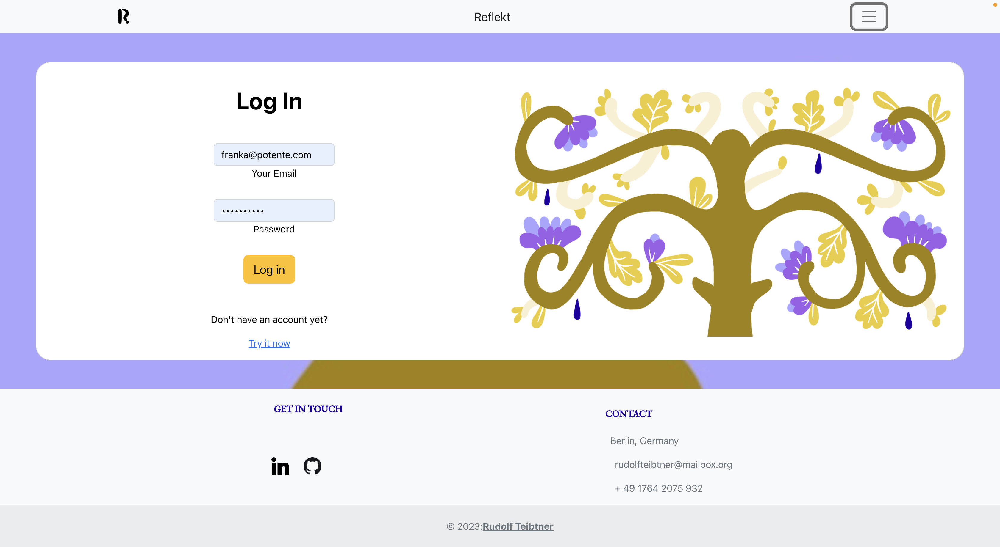

# Reflekt Client (React.js)

## About the project
Reflekt is a journaling tool where users can post questions they want to think about. It serves a tool for introspection and personal development.

**NOTE: This repo is the frontend (React.js) of the project. For the backend (Express API) see: https://github.com/Rudolfus/reflekt-server**

### Screenshot



## Getting started
To run in your computer, follow these steps:

* Fork this repo
* run the following commands:
```
$ git clone 
$ npm install
$ npm start
```

* create a .env file with the following environment variable:

* REACT_APP_API_URL = https://reflekt-app-server.adaptable.app

* run the application:

```
npm run dev || npm start
```

## Demo
The frontend of REFLEKT can be found here: https://reflektapp.netlify.app/